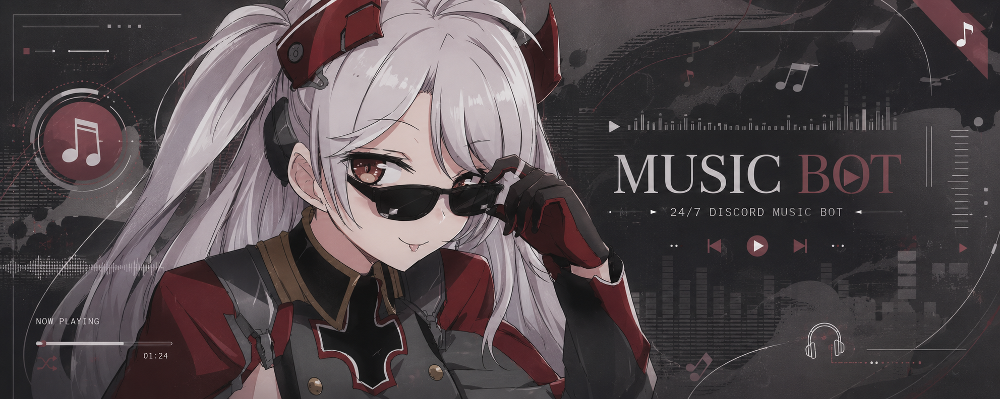

<div align="center">
  
  <br>
  <h1>🎵 Eugen Music</h1>
  <p><b>Advanced, High-Performance Discord Music Bot powered by Shoukaku & Lavalink</b></p>
  <p>Supports YouTube, Spotify, SoundCloud, Apple Music, and more with fully dynamic i18n!</p>
</div>

---

## ✨ Features

- **High Performance:** Uses `shoukaku` (Lavalink wrapper) for minimal resource footprint and ultra-low latency.
- **Hybrid i18n (Multi-Language):** Features an advanced multi-language system. The bot responds to the command invoker in their preferred language, while public announcements (like "Now Playing") respect the DJ's language.
- **Dynamic UI:** Features Discord UI components (Buttons, Select Menus) for Queue management, Lyrics, and Now Playing.
- **Autoplay & 24/7 Mode:** Automatically find and play related songs when the queue ends, or stay in the VC forever.
- **Auto-TTS:** Reads text messages sent in the active music channel (perfect for AFK listeners).
- **Session Restoration:** If the bot restarts, it seamlessly reconnects to the voice channel and resumes the song exactly where it left off!
- **Filters & Volume Control:** Audio filters (Bassboost, Nightcore, Vaporwave) and volume management.
- **Owner & Trusted System:** Prevent trolls from hijacking the music session by claiming ownership of the DJ session.

## 🚀 Installation & Setup

1. **Clone the repository:**

   ```bash
   git clone https://github.com/PrinzXz/Eugen-Music.git
   cd Eugen-Music
   ```

2. **Install dependencies:**

   ```bash
   npm install
   ```

3. **Configure Environment:**
   Create a `.env` file in the root directory:

   ```env
   TOKEN=your_discord_bot_token
   PREFIX=e.
   BOT_NAME=Eugen MUSIC
   ```

4. **Lavalink Configuration:**
   Ensure you have a Lavalink node running or configured in `config.js` (`lavalink` array).

5. **Run the bot:**
   ```bash
   node src/index.js
   ```

## 🌐 Multi-Language Support

Users can set their preferred language by running:

- `/language en` (English)
- `/language id` (Indonesian)

Want to add a new language? Simply create a new `es.json` or `jp.json` file inside `src/locales/`!

## 🎨 Custom Emojis Setup

This bot uses custom emojis for its UI components (buttons, select menus, messages). 
To ensure the UI looks correct, you must upload the provided emojis to your Bot's Application on the Discord Developer Portal:

1. Locate the `custom_emojis` folder in this repository.
2. Go to the [Discord Developer Portal](https://discord.com/developers/applications/).
3. Select your Bot Application, and navigate to the **Emojis** tab on the left sidebar.
4. Upload all the `.png` or `.gif` files from the `custom_emojis` folder.
5. (Optional) If the emoji names or IDs change, you can update them in `config.js` to match your newly uploaded emojis.

---

## 🤝 Credits & Contributors

A massive thank you to all the contributors who helped make this project possible. Pull requests are always welcome!

<a href="https://github.com/PrinzXz/Eugen-Music/graphs/contributors">
  
</a>

---

> A **PX - Team** Project | Made with ❤️ for Discord Communities.
